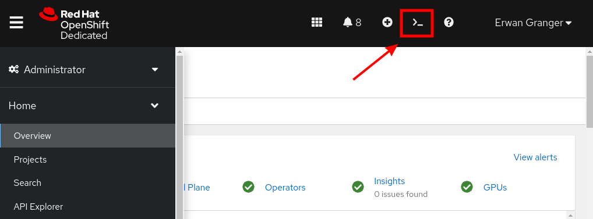

# Streamlit OpenShift Build

## Disclaimers

The method described here is not the only method, but it's a quick way to get started.

The Streamlit app is stored in this [github repo](https://github.com/wjbmattingly/dap_app).

A [Dockerfile](Dockerfile) is created in this repository for now but it would be better if it eventually was moved to the same repo as the code.

## Pre-Reqs:

* An OpenShift Cluster
* The ability to create a new project, or enough permissions into an existing project
* an `oc` CLI properly configured and authenticated into the OpenShift Cluster
  * (using the "Web Terminal" is highly recommended for simplicity's sake)

## Deployment method

* Connect to the OpenShift Console, and Start a Web Terminal session
  
* In the web Terminal, git clone this very project by executing:
    ```bash
    git clone https://github.com/erwangranger/smithsonian-related.git
    ```
* then, move to the right subfolder, and execute the deployment script:
    ```bash
    cd ~/smithsonian-related/streamlit-build/
    bash deploy_on_openshift_cluster.sh
    ```
* once this is deployed, execute the following command to see the URL of the app:
    ```bash
    printf "Application URL: http://$(oc -n dap-app get route smithsonian-related -o jsonpath='{.spec.host}{"\n"}')\n"
    ```